# CARE - Community Action for Resources and the Environment
***
## Overview 

Welcome to the homepage of CARE, a Dublin based community group passionate about helping the environment, promoting sustainability and eco-friendliness. The site sets out who the group are, what they aim to achieve and how and allows members of the community to get actively involved through engagement with social media profiles, participation in organised events and/or through application of suggested tips in their own day to day life.  

**NOTE: This group has been created for the sole purposes of creating this website to demonstrate HTML and CSS skills. The group itself and the events noted are not real.**

## Live Site

[CARE - Community Action for Resources and the Environment](https://lw83.github.io/Project1-CARE/)

## Repository 

[https://github.com/LW83/Project1-CARE](https://github.com/LW83/Project1-CARE)
***
## Concept & Planning 

### UX

- __Target Audience__

   - Individuals passionate about the environment and keen to get involved in environmentally-focused activities.
   - Individuals interested in making environmentally friendly changes in their own life and looking for tips and ideas.
   - Individuals in the Dublin area who are looking to integrate more into their community and get to know people through social events.
   - Other environmental groups in Dublin and further afield for ideas on what other groups are doing and/or initiatives that it may be possible to collaboarate on. 

- __User Stories__

   - As a new user, I want to understand more about the group and what it does.
   - As a user, I want to know about events being run in my area. 
   - As a user, I want to know more about past events that have been run and where. 
   - As a user, I want to be able to get ideas of things I can do myself in this space to make an impact.
   - As a user, I want to be able to be kept informed of the latest news without having to go to the site proactively to check for updates. 
   - As a user, I want to be able to find the information I want from the site quickly and easily.

- __Site aims__
 
  - The site aims to meet the above user requirements through the following: 
    - Implementation of a site with logical flow and easy, intuitive navigation. 
    - Not overwhelming the user with content. 
    - Setting out some high-level information about the group on the homepage to give the user more context. 
    - Providing details of upcoming events and locations for those who wish to get involved. 
    - Providing details of recent events and social media links for those who were involved or want to get more of a feel for what events are like. 
    - Providing suggested tips to users to allow them to implement what they feel comfortable doing in their own lives. 
    - Facilitating input from users to involve them and make them feel part of the solution. 
    - Providing easy access to related social media pages for additional photos and updates. 
    - Enabling users to sign up to a newsletter for updates on the groups latest content. 
    - Balancing the message with some humor to engage the user and to ensure a feeling of approachability. 

### Wireframes
 Once I had decided on the theme for the site, I used Balsamiq to do some high level wireframes for the desktop version of the site: 

__Homepage__

 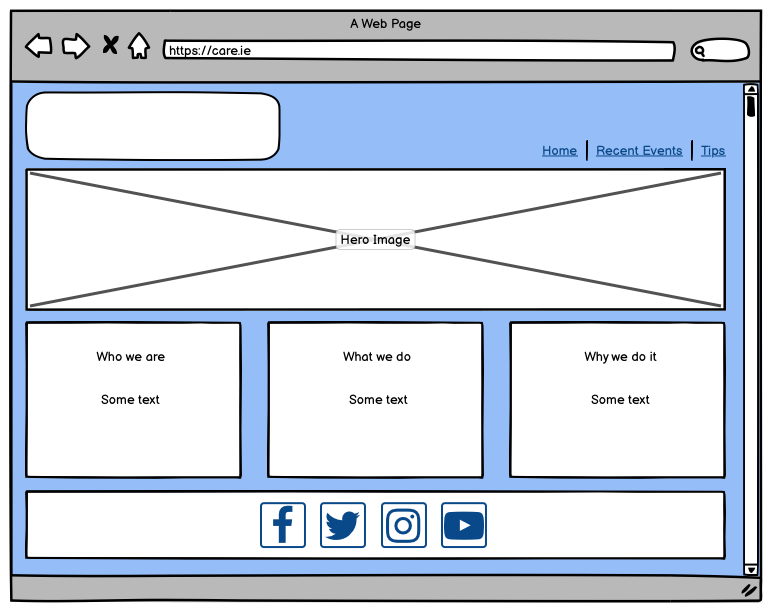
  - I knew I wanted to set out three boxes with information about who the group is, what they do and why they do it. 
  - The key change in the final site from the wireframe is that I decided to overlay the logo and nav bar on top of the hero-image as once I found the image I felt that this looked more visually striking. 
  - I also decided to include the newsletter sign up in the footer bar to facilitate this sign-up as the footer would be replicated across all pages. 

__Events page__

  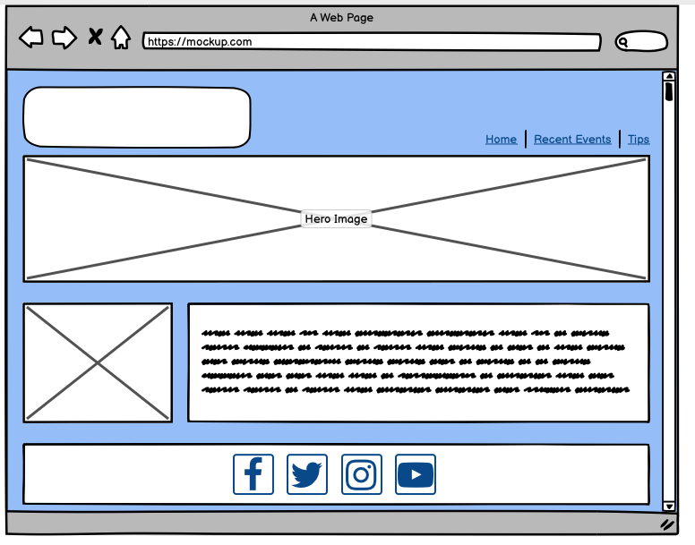
   - The key change in the Events page was to have three events for each month sit side by side in a row on the desktop display rather than stacked as this makes it easier for the user to see a summary of what is planned quickly and easily. 
   - For tablet screen sizes, the initial plan to stack each event was implemented so as not to make the information on a single row too crowded on a smaller screen size. 

__Tips page__

  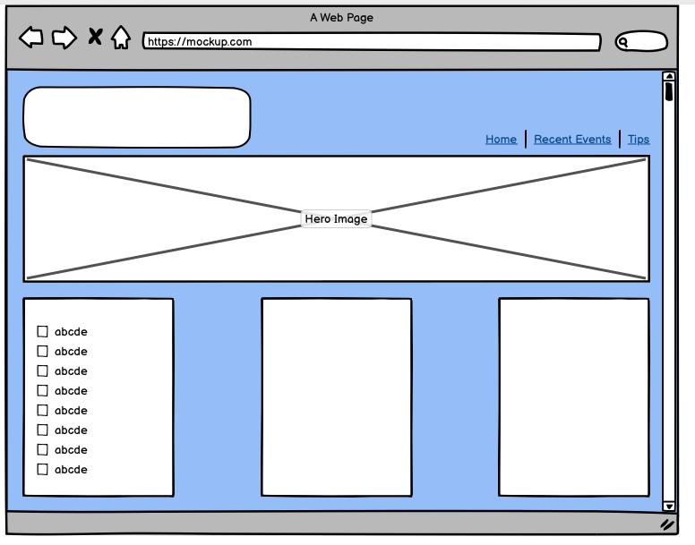
   - The key change in the Tips page from the original wireframe concept was to have include a tips submission form to encourage engagement from the user. 

__Mobile view__

  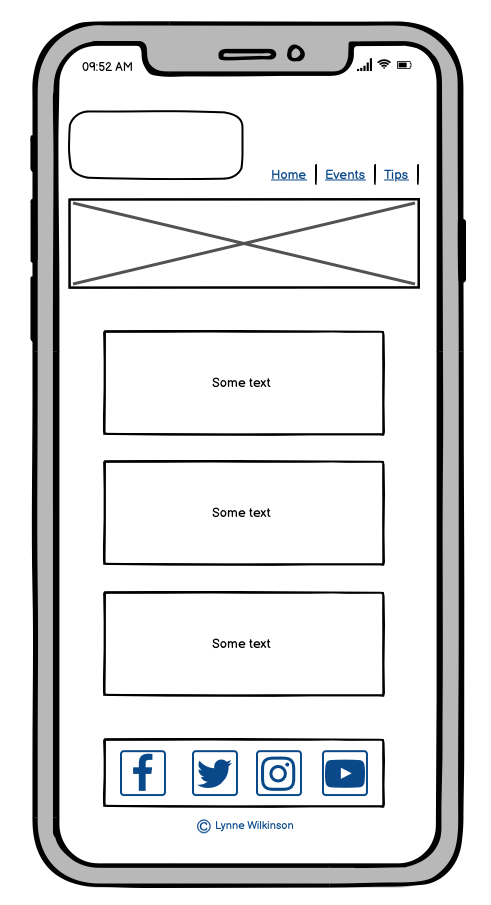
   - The key intention from the mobile mock-up was that the information would be stacked vertically as opposed to shown vertically across larger screen sizes.  

### Color Scheme
- To decide on the color scheme for the site, I first selected the hero-image which would make up the header across each of the pages. This image was selected from [Pxhere](https://pxhere.com/).
- Once I had decided on the image, I used [Image Color Picket](https://imagecolorpicker.com/en) to identify different colors within the image to use as the basis for font, border and icon colors within the site. 
- In order to ensure the colors selected had sufficient contrast to meet accessibility requirements, I validated the color palette using [Eight Shapes Contrast Grid](https://contrast-grid.eightshapes.com).

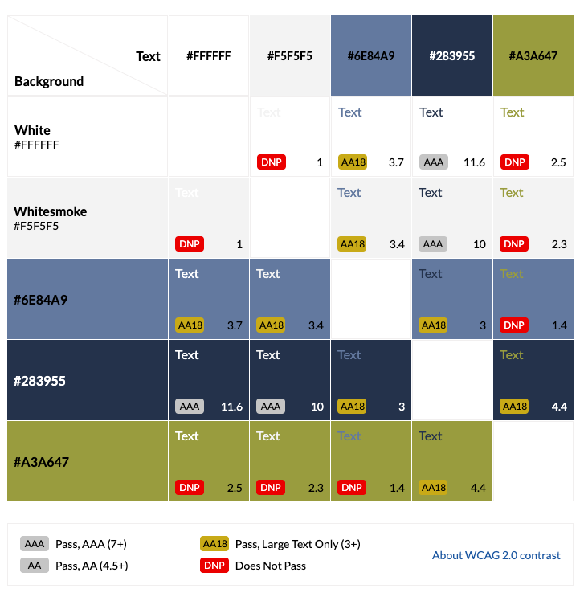

### Fonts
 - The fonts utilised are consistent across the page and are from [Google fonts](https://fonts.google.com/). 
 - The font for the logo and navigation bar is Red Hat Display. I chose this font as I felt it wass strong, very legible and helped created a good first impact against the striking hero image. 
 - For the body of the site, I have used Comic Neue. I chose this font for the main body as I felt it balanced friendliness and approachability whilst maintaining a clean and professsional look. 
 - Sans serif has been applied as a backup font for both. 

***
## Existing Features 

### Header & Navigation

__Hero image__

  - All pages of the site have a consistent header, a key element of which is large and striking image of Ireland which drives the color palette for the entire site and reinforces the focus of the group being an Irish based, environmentally-focused community group. 
  - In the event that the image does not load, there is also background color assigned to ensure the logo and navigation bar remain fully visible to the user. 

  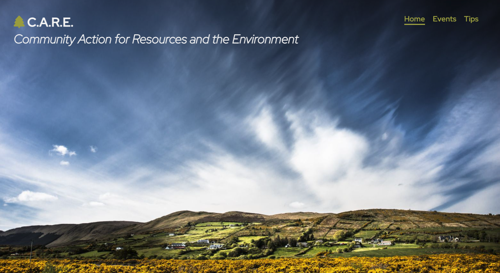

__Logo__

  - The logo sets out both the abbreviated and full name of the group and is complimented by a font awesome icon to denote the environment.
  - The font has a color of whitesmoke to contrast against the color of the hero-image whilst being complimentary to the clouds in the image and links back to the homepage across all pages of the site.

  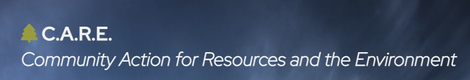

  - The logo is fully responsive and wraps for smaller screen sizes. 

  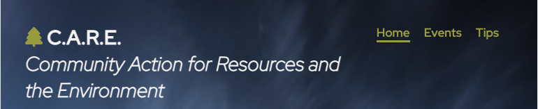

__Navigation Bar__

  - Featured on all three pages, the navigation bar includes links to the Home page, Events and Tips pages and is replicated in design and functionality across each page to allow for consistency, easy navigation and good UX.
  - This has been floated to the right of the page to align with the top of the CARE logo. 
  - The navigation links are all in whitesmoke to contrast against the color of the hero-image whilst being complimentary to the clouds in the image. The below image shows the user's current page highlighted in blue with a white border.
  - When hovered over, the links are highlighted in a lighter shade of blue to provide feedback to the user and again utilising colors from the hero-image. 
  - When visited, the links change to a shade of green again to replicate colors from the hero image and to provide feedback to the user. 
  
  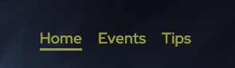
  
  - An active class has also been implemented to highlight to the user the current page being viewed. 
  - The navigation bar is fully responsive and for smaller screens, the bar drops below the logo retaining its place on the right side of the screen so as not to compete for space with the logo. In addition the font-color remains white smoke to ensure sufficient contrast with the hero-image given the new placement. 
  
  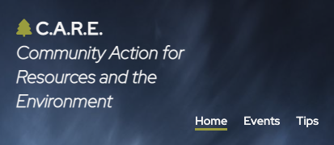

__Favicon__

  -  A favicon has been added to show up in the title of the page and is consistent with the icon used in the logo itself. 
  
  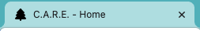

### Footer

  - Similar to the header, all pages of the site have a consistent footer which has two key elements being the option to subscribe to the group's newsletter and links to the group's social media pages. 
  - Again the styling of the footer is driven by the color scheme coming from the hero-image. 
  - The newsletter subscribe button again has a hover feature to provide feedback to the user and when submitted takes the user to a thank you page. 
  - Social media links for Facebook, Instagram, Twitter and YouTube are included and all open links to the homepages of these sites in a new tab. This is for demonstration purposes only and no social media pages have been created. 
  - All social media links are represented by Font Awesome icons. 
  - Finally, the footer includes a note regarding copyright and a call-out that the site is fictional in nature. 

  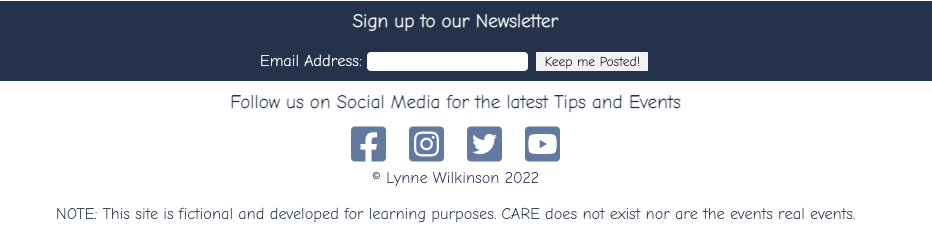

### Home Page

  - The About section of the Home page is focused on setting out for the user who the group are, what they do and why they do it. 
  - Boxes and font awesome icons have been added to distinguish these sections.
  - This page has been kept deliberately lighter on content so as not to overwhelm a potential new user.  
  - For desktop layouts, the about boxes sit side by side in a float structure. 

  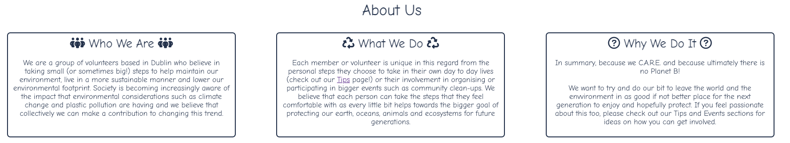

  - For tablet and mobile layouts, the about boxes stack on top of each other and take the full width of the page to maintain a clean and simple flow.  

  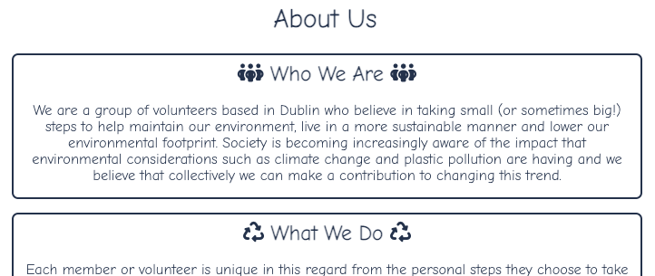

### Events Page

  - The Events page of the site sets out both current events planned for upcoming months and recent events that the group have organised. The current events are shown first on the page and recent events after to follow what the user would expect when looking for event information. 
  - Current events set out the time, date and location for each event and include an image from the location to engage the user. 
  - Recent events set out date of the event and some brief information regarding the number of volunteers that turned out as well as links to Facebook and Instagram social media pages for further photos of the event. Again this is for demonstration purposes and no social media pages have been created for this purpose. 
  - The social media links all open in new tabs for the user. 
  - All images in the Events page have been compressed to improve site performance.
  - For desktop layouts, the events are organised in a row of three events with text details of the event provided underneath an image of the location. 

  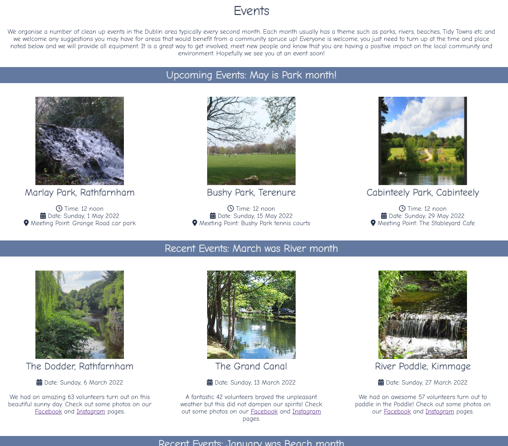

  - For tablet layouts, the events are stacked with the image to the left of the page and details in a box to the right of the image. The box has been added as it made for better visual respresentation under this structure and was inkeeping with the other pages and the utilisation of boxes. 

  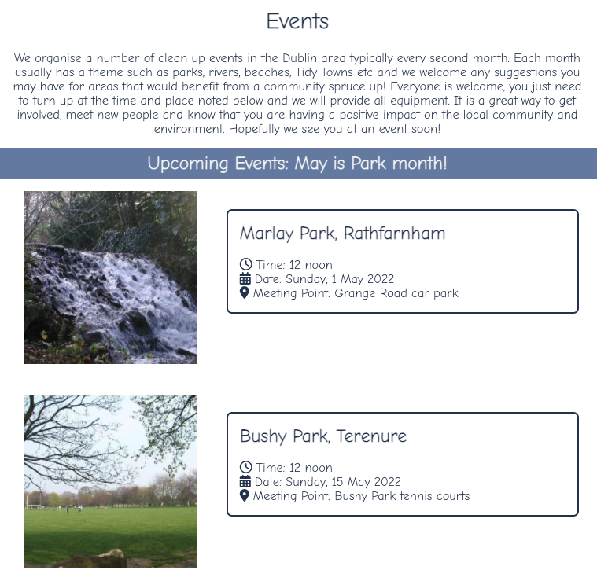

  - For mobile layouts, the events remain stacked but the text for the event moves underneath the image and the box is removed to simplify the visual effect for smaller screen sizes. 

  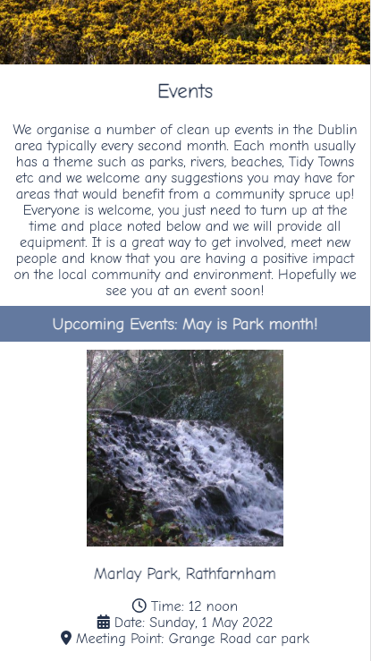

### Tips Page

  - The Tips page of the site provides a list of tips for the user to implement in different aspects of their day to day life. This is arranged by area to faciliate the user focusing on a specific aspect such as Shopping or Garden. It provides handy tips ranging from the very small to more substantial that a user can implement based on what suits their individual lifestyle and preferences. 
  - Consistent with the structure of the homepage, the tips have been organised into boxes with relevant font awesome icons applied to help differentiate each box for the user. 
  - Some fun has been added in to the comments to lighten the content and help to engage the user. 
  - Within the tips page, there is a link to a Panda reference guide for recycling which opens in a new tab for the user. 
  - The page also includes a form which enables users to submit their own tip suggestions for inclusion on the page again encouraging engagement and action from the user. 

  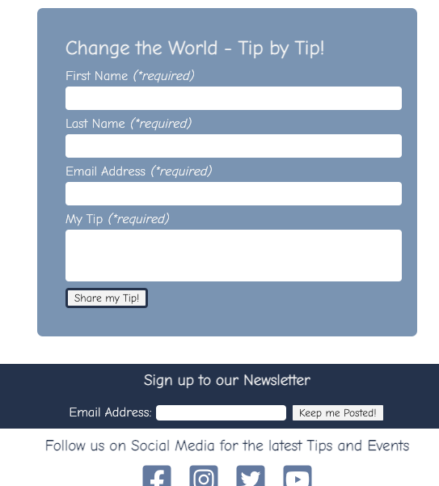

  - For desktop layouts, the tips are separated into three boxes per row. 

  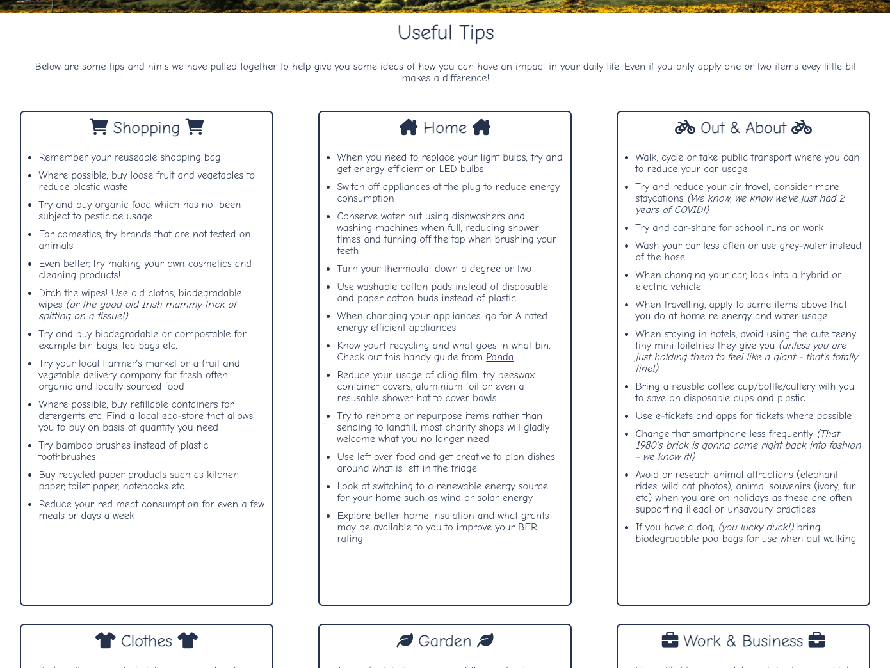

  - For tablet and mobile devices, this changes to one screen width box.

  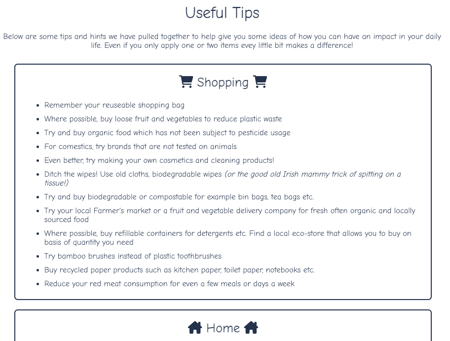

  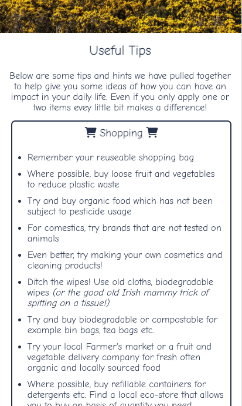

### Form Dumps

  - Two hidden form feedback pages exist to provide feedback to the user where they sign up to the newsletter or submit a tip suggestion. 
  - These are not functioning forms but are created using the method "Get" to call a feedback page. 
  - Following a sign-up to the newsletter, the user is taken to a page with a "Welcome! Thanks for signing up!" message and a link to return to the homepage. All other aspects of the page including header and footer are consistent with the other pages of the site. 

  

  - Following a tip-submission, the user is taken to a page with a "Thank you for your submission!" message and a link to return to the homepage. Again, all other aspects of the page including header and footer are consistent with the other pages of the site.

  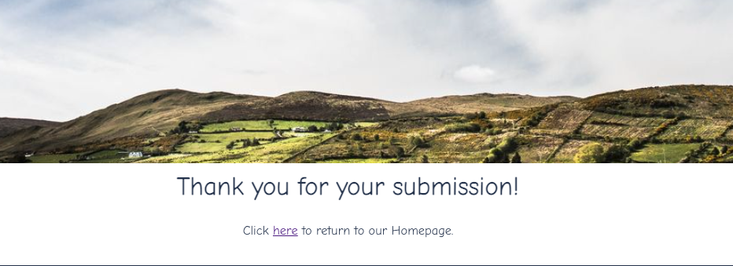
***
## Potential Future Features

 - Potential additional future features for the site include: 
      - Embedding a video in the About section of the Home page was considered but due to the fictional nature of the group it was not possible to find a suitable video. This is something that could be added at a future point. 
      - Image gallery: It may be worth including a gallery of images from events within the site itself for users. Currently the site directs users to social media profiles for the group to meet this requirement as the more common way for sharing more real-time updates. 
      - Download functionality for Tips page: Given the content included in the tips page, providing fucntionality for users to download the list is a future fucntionality for the site which would likely be beneficial.  
***
## Testing 

### Responsiveness Testing
 - Responsiveness of the site was tested using Dev Tools for all screen size widths from 320px up to 1750px.
 - Responsiveness was also specifically checked for the following devices within Dev Tools:
      - iPhone SE
      - iPhone XR
      - iPhone 12 Pro
      - Pixel 5
      - Samsung Galaxy S8+
      - Samsung Galaxy S20 Ultra 
      - iPad Air
      - iPad Mini
      - Surface Pro 7 
      - Surface Duo
      - Samsung Galaxy A51/71
      - Nest Hub
      - Nest Hub Max
 - Specific breakpoints for each page were identified and managed through media queries. These were focused on adjusting the layout of boxes on the page, the size of margins and padding and also adjusting the font-size for smaller screen sizes. 
 - I did not use Flexbox or CSS Grid in this project as I wanted to better familiarise myself and understand the float model but plan to use one or both of these newer methods in a future project. 

### Browser Testing
  - The site was developed and tested using Google's Chrome browser. 
  - The site has also been tested on Safari and functions as intended. 

### Accessibility Testing 

  - The accessibility of the site has been tested through the following tools: 

    - Dev Tools Lighthouse Report (screenshot included in Validation Testing section below)
    - [Wave (Web Accessibility Evaluation Tool)](https://wave.webaim.org/)
          [Wave Homepage Test](./docs/wave_homepage_test.png)
          [Wave Events Page Test](./docs/wave_eventspage_test.png)
          [Wave Tips Page Test](./docs/wave_tipspage_test.png)
    - [A11y project checklist](https://www.a11yproject.com/checklist/) 

  - The following aspects of the site development have been specifically included with accessibility in mind and as recommended by the above sources: 
    - For all images on the Events page, alt tags with appropriate descriptions have been applied.
    - Keyboard navigation for the site has been tested and is functioning as expected. 
    - Each page has its own title description (e.g. CARE - Home, CARE - Events, CARE - Tips). 
    - All color contrasts have been tested and validated. 
    - All forms have appropriate labels and the tips form specifically calls out in text the required fields. 
    - Icons including social media icons have appropriate aria-labels applied. 
    - Semantic HTML tags have been used including headers, nav, h1, h2, h3, section, footer. 
 
### Validation Testing 

__HTML Validation__
  - No errors were returned for any of the pages in the site when passing through the official W3C Validator. 
  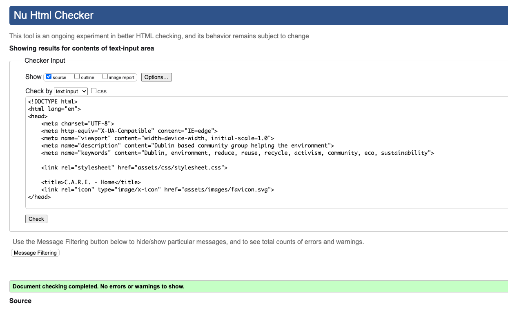
  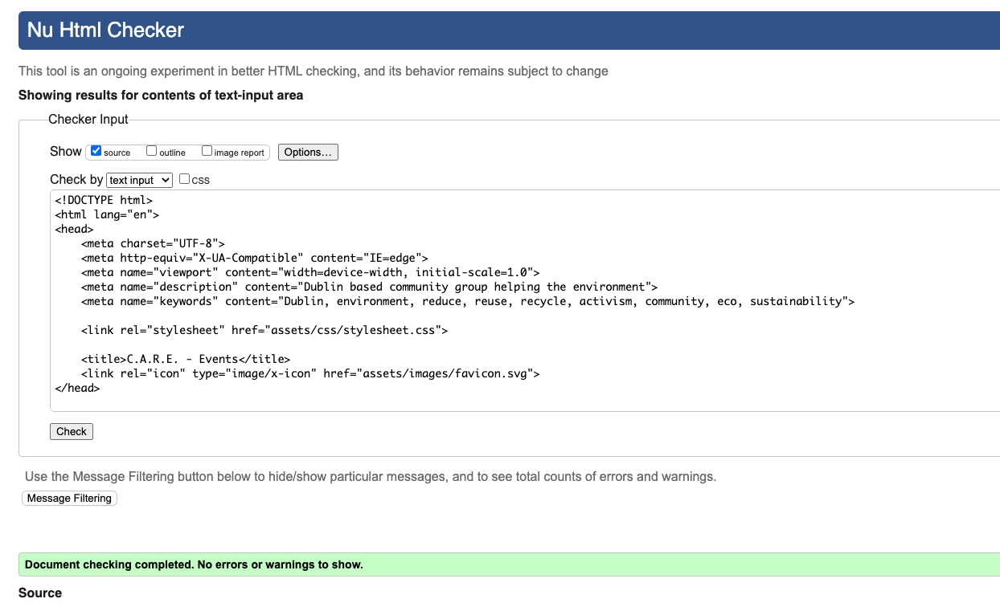
  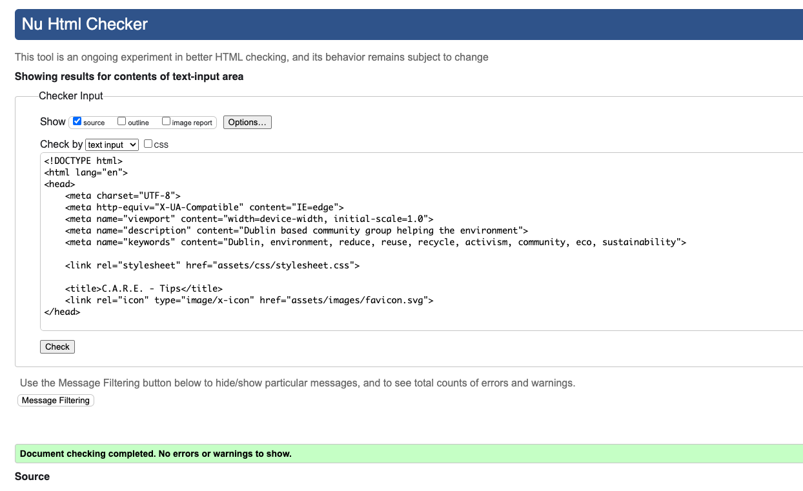

__CSS Validation__
  - No errors were found when passing through the official W3C Validator.
  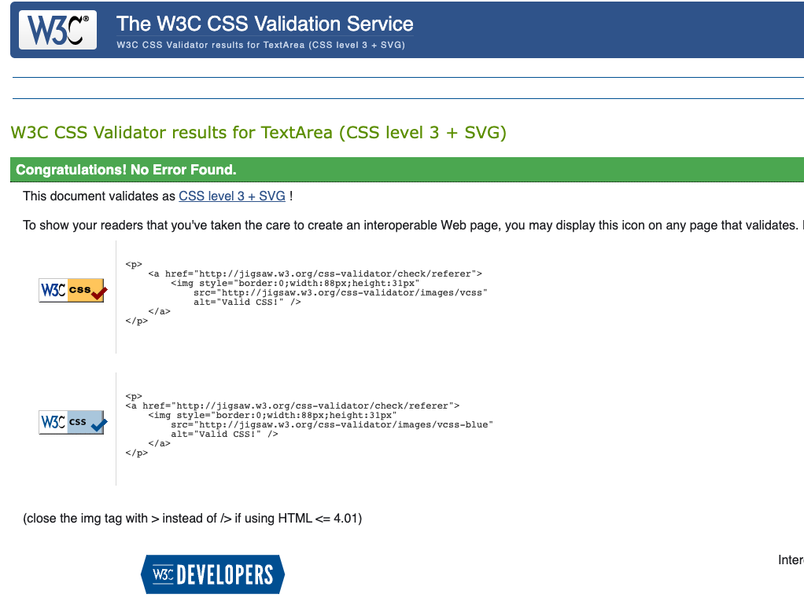

__Lighthouse Report__
  - In addition to the HTML and CSS Validation, I generated a lighthouse report for the site pages through Dev Tools.

  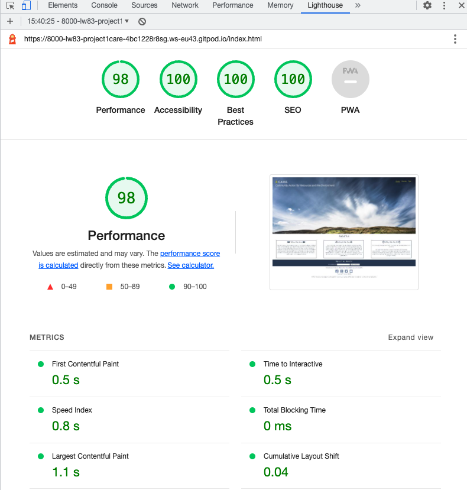

  

  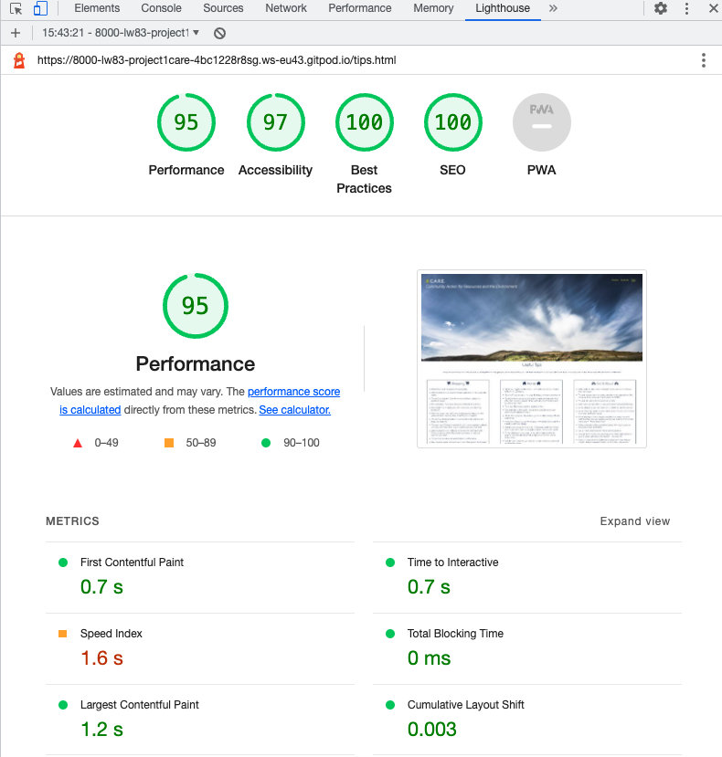

  In addition all links within the site have been tested to ensure they are functioning as intended. 

### Fixed Bugs
 - Most bugs I had during the development of this project related to playing around with sizes and positioning particularly in relation to responsiveness of the site to difference screen sizes and were largely resolved through trial and error. 
 - Header Logo Div: One specific issue I had early on in the project was a white gap that was appearing between the hero image and the top of the page once the logo had been added. After some trial and error, I found that applying a float:left to the logo div resolved this issue and the hero image sat flush to the top of the page. 
 - Tip Submission Form: I had initially tried to use absolute positioning for the tip submission form on the Tips page but was struggling to centre the box properly and found it was not well suited to different screen sizes. I instead applied margin:auto to centre within the container div on the page.
 - GitHub Deployment: When I first deployed the page to GitHub, I found the images across the site were not loading. After some research on GitHub Community, I found that this was due to me having a / before the assets folder in the directory path which was preventing the files from loading. 

### Unfixed Bugs
- During the project there were a couple of ideas I had which I found were not possible to implement for various reasons, so whilst not stricly unfixed bugs these included:
  - Bold: My preference was to bold the H2 headings on the three pages of the site to give them more vidual impact however having tried using font-weight and strong, neither were applying a bold finish to the headings. After some research I found that certain fonts will not support a bold style. Given that I was happy with the font, I decided to keep the font and forgo bolding the headers as I don't believe it makes a significant impact for the user of the site. 
  - Form feedback: Initally I had wanted to include a font awesome 'thumbs up' icon to provide user feedback on sign up to the newsletter without taking the user away from the site page that they were on, however I was not able to find a method of doing this via CSS and HTML and believe Javascript may be required for this functionality. 
  - Hero-image scaling for screen widths above 2200px: When the site is displayed on screens above 2200px, the land portion of the hero image is lost which detracts slightly from the visual impact of the site. I may explore in future whether it is more appropriate to pull in an alternative image for viewing on larger screen sizes but given how the hero image drives the color palette for the site, it is not something I have implemented in the current design.
 
***
## Deployment

- The site was deployed to GitHub pages following the below deployment steps: 
  - In the GitHub repository, navigating to the Settings tab 
  - From the source section drop-down menu, selecting the Master Branch
  - Once the master branch was been selected, the page automatically refreshed with a detailed ribbon display to indicate the successful deployment. 

The live link can be found here: [CARE - Community Action for Resources and the Environment](https://lw83.github.io/Project1-CARE/) 

As noted above, on initial deployment of the site to GitHub pages, I found the images were not loading and upon some research I found that I needed to remove the first forward slash in address location in order to pull in the image correctly for the deloyed site. This was resolved thanks to the GitHub community forum. 

***
## Credits  

### Content 
 - As this group is fictional a large portion of the content of the site is also fictional including the About and Events sections of the site. 
 - For the tips page, this content has been created but leverages ideas and content from the following books:
     - 12 Small Acts to Save Our World - WWF
     - Save the World There is no Planet B - Louise Bradford

### Media
 - The images used in the site have been taken from the following sources and copyright remains with these sources: 
     - Hero Image: [Pxhere](https://pxhere.com)
     - Marlay Image: [Wikipedia](https://en.wikipedia.org/wiki/Marlay_Park)
     - Bushy Image: [Wikipedia](https://en.wikipedia.org/wiki/Bushy_Park,_Dublin)
     - Cabinteely Image: [DLRCoCo](https://www.dlrcoco.ie/en/cabinteely-park)
     - Dodder Image: [Wikipedia](https://en.wikipedia.org/wiki/River_Dodder)
     - Grand Canal Image: [Wikipedia](https://en.wikipedia.org/wiki/Grand_Canal_(Ireland))
     - Poddle Image: [Wikipedia](https://en.wikipedia.org/wiki/River_Poddle)
     - Sandymount Image: [Flickr - ALESSIO MICHELINI](https://www.flickr.com/photos/darkmavis/48503014761)
     - Sandycove Image: [Ireland Higlights](https://www.irelandhighlights.com/info/sandycove-beach/)
     - Killiney Image: [DLRCoCo](https://www.dlrcoco.ie/en/news/general-news-press-releases/blue-flag-awarded-killiney-and-seapoint-beach)

### Languages Used
  - HTML5
  - CSS3

### Tools & Online Resources Utilised
 - The following tools and resources have been utilised in the creation of this project: 
     - [Balsamiq](https://balsamiq.com/): For creation of wireframes.
     - GitHub & Gitpod: For development and deployment of the site.
     - [Pxhere](https://pxhere.com): To provide a suitable hero image. 
     - [Image Color Picker](https://imagecolorpicker.com/en): To match colours from the hero image.
     - [Google Fonts](https://fonts.google.com/): For site fonts.
     - [Image resizer](https://imageresizer.com/): For resizing images.
     - [Compressor.io](https://compressor.io/): For compressing image file sizes. 
     - [Font Awesome](https://fontawesome.com/): For icons used across the site. 
     - [FS Symbols](https://fsymbols.com/copyright/): For the copyright symbol for inclusion in the footer. 
     - [W3 Schools](https://www.w3schools.com/html/html_favicon.asp): For general guidance and research and for how to include a favicon. 
     - [Code Grepper](https://www.codegrepper.com/code-examples/html/css+change+font+awesome+icon+color): To change the colour of the font awesome icon in logo.
     - [Stack Overflow](https://stackoverflow.com/questions/19089018/how-to-align-form-at-the-center-of-the-page-in-html-css): For general guidance and research and for how to centre form.
     - [WAI Test](https://www.w3.org/WAI/test-evaluate/preliminary/): For accessibility checks
     - [Wave (Web Accessibility Evaluation Tool)](https://wave.webaim.org/): For accessibility checks
     - [A11y project checklist](https://www.a11yproject.com/checklist/): For accessibility checks
     - [Eight Shapes Contrast Grid](https://contrast-grid.eightshapes.com): For color contract checks
     - [Slack](https://slack.com/intl/en-ie/): For general guidance and research on project considerations, positioning and sizing. 
     - [GitHub Community Forum](https://github.community/): For guidance on resolving image load on deployment of site. 
     - Google Chrome Dev Tools: For validation and responsiveness checks
     - [Am I Responsive](https://ui.dev/amiresponsive): To create the multi-device screenshot for inclusion in my Readme file. 
     - [W3C CSS (Jigsaw) Validator](https://jigsaw.w3.org/css-validator/)
     - [W3C HTML Validator](https://validator.w3.org/)
     - Code Institute & Love Running Demonstration: For guidance and inspiration for this site. 

### People
 - In addition a big thank you to the following people for their assistance in this project:
     - Kasia Bogucka: Our cohort facilitator for keeping us all on track and answering all and any of the many questions!
     - My cohort: For our weekly checkins and tips
     - David Bowers: For the guidance, notes and videos shared via Slack that were extremely useful in planning and executing this portfolio project. 