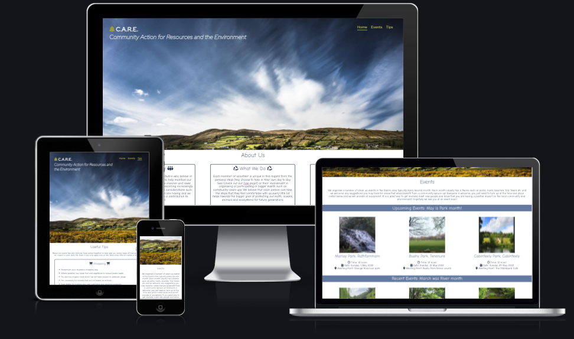

# CARE - Community Action for Resources and the Environment

## Overview 

Welcome to the homepage of CARE, a Dublin based community group passionate about helping the environment, promoting sustainability and eco-friendliness. The site sets out who the group are, what they aim to achieve and how and allows members of the community to get actively involved through engagemet with social media profiles, participation in organised events and/or through application of tips in their own day to day life.  

**NOTE: This group has been created for the sole purposes of creating this website to demonstrate HTML and CSS skills. The group itself and the events noted are not real.**

## Live Site

[CARE - Community Action for Resources and the Environment](https://lw83.github.io/Project1-CARE/)

## Repository 

[https://github.com/LW83/Project1-CARE](https://github.com/LW83/Project1-CARE)
***
## Concept & Planning 

Who - UX Design, Audience, User Stories, Site Aims
Achieve
Wireframes
Color Scheme 
Typography
***
## Existing Features 

## Header & Navigation

- __Hero image__

  - All pages of the site have a consistent header, a key element of which is large and striking image of Ireland which drives the color palette for the entire site and reinforces the focus of the group being an Irish based, environmentally-focused community group. 

  

- __Logo__

  - The logo sets out both the abbreviated and full name of the group and is complimented by a font awesome icon to denote the environment.
  - The font has a color of whitesmoke to contrast against the color of the hero-image whilst being complimentary to the clouds in the image and links back to the homepage across all pages of the site.

  

  - The logo is fully responsive and wraps as screen widths reduce. 

  

- __Navigation Bar__

  - Featured on all three pages, the navigation bar includes links to the Home page, Events and Tips pages and is replicated in design and functionality across each page to allow for consistency, easy navigation and good UX.
  - This has been floated to the right of the page to align with the top of the CARE logo. 
  - The navigation links are all in whitesmoke to contrast against the color of the hero-image whilst being complimentary to the clouds in the image. The below image shows the user's current page highlighted in blue with a white border.
  - When hovered over, the links are highlighted in a lighter shade of blue to provide feedback to the user and again utilising colors from the hero-image. 
  - When visited, the links change to a shade of green again to replicate colors from the hero image and to provide feedback to the user. 
  
  - An active class has also been implemented to highlight to the user the current page being viewed. 
  - The navigation bar is fully responsive, for smaller screens, the bar drops below the logo retaining its place on the right side of the screen so as not to compete for space with the logo. In addition the font-color remains white smoke to ensure sufficient contrast with the hero-image given the new placement. 
  

- __Favicon__

  -  A favicon has been added to show up in the title of the page and is consistent with the icon used in the logo itself. 
  

  - __The Footer__ 

  - Similar to the header, all pages of the site have a consistent footer which has two key elements being the option to subscribe to the group's newsletter and links to the group's social media pages. 
  - Again the styling of the footer is driven by the color scheme coming from the hero-image. 
  - The newsletter subscribe button again has a hover feature to provide feedback to the user and when submitted takes the user to a thank you page. 
  - Social media links for Facebook, Instagram, Twitter and YouTube are included and all open links to the homepages of these sites in a new tab. This is for demonstration purposes only and no social media pages have been created. 
  - All social media links are represented by Font Awesome icons. 
  - Finally, the footer includes a note regarding copyright and a call-out that the site is fictional in nature. 

- __About Section__

  - The About section on the site is focused on setting out for the user who the group are, what they do and why they do it. 
  - Boxes and font awesome icons have been added to distinguish these sections.
  - This page has been kept deliberately lighter on content so as not to overwhelm a potential new user.  

- __Events__

  - Placeholder 
  - This section is valuable to the user because

- __Tips__

  - This page allows the user to  

- __Form Dump__

### Potential Future Features

- Placeholder

### Testing 

## Responsiveness Testing

## Browser Testing

## Accessability Testing 

### Validation Testing 

- HTML
  - No errors were returned for any of the pages in the site when passing through the official W3C Validator. 
  [W3C validator Homepage](./docs/w3c_homepage_htmlvalidation.png)
  [W3C validator Events](./docs/w3c_eventspage_htmlvalidation.png)
  [W3C validator Tips](./docs/w3c_tipspage_htmlvalidation.png)

- CSS
  - No errors were found when passing through the official [(Jigsaw) validator](./docs/w3c_css_validation.png)

### Unfixed Bugs
 

## Deployment

- The site was deployed to GitHub pages following the below deployment steps: 
  - In the GitHub repository, navigate to the Settings tab 
  - From the source section drop-down menu, select the Master Branch
  - Once the master branch has been selected, the page automatically refreshed with a detailed ribbon display to indicate the successful deployment. 

The live link can be found here: [CARE - Community Action for Resources and the Environment](https://lw83.github.io/Project1-CARE/) 

In deploying the site to GitHub pages, images issue.....

## Credits  

### Content 

- The text for the tips page was 
- The icons in the footer were taken from [Font Awesome](https://fontawesome.com/)
- Google Fonts
- Love Running 
- W3C Validators
- Color
- Accessability 

### Media

- The photos used on the home and sign up page are from 
- The images used for the gallery page were taken from 

https://imagecolorpicker.com/en - used to match colour in photo to text etc
https://fsymbols.com/copyright/ for copyright symbol
https://www.w3schools.com/html/html_favicon.asp for favicon 
https://www.codegrepper.com/code-examples/html/css+change+font+awesome+icon+color to change colour of font awesome icon in logo
https://stackoverflow.com/questions/19089018/how-to-align-form-at-the-center-of-the-page-in-html-css to centre form in middle of page 0 auto
https://imageresizer.com/
https://pxhere.com hero-image
https://compressor.io photo compressor
https://www.w3.org/WAI/test-evaluate/preliminary/ - accessibility checks - alt tags, keyboard navigation, title description color contrast, form labels and keyboard access, required
https://wave.webaim.org/
https://www.a11yproject.com/checklist/